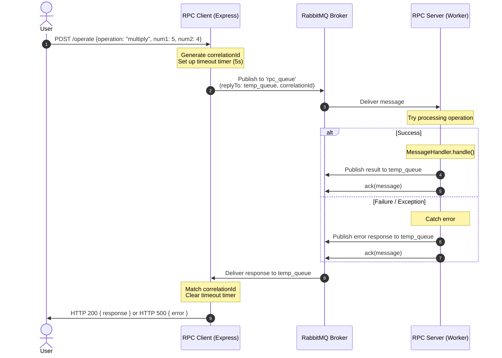

# Lesson 6 Exercise: Production-Ready RPC Pattern

In this exercise, you will transform a basic RabbitMQ RPC implementation into a **production-ready, resilient, and reliable** event-driven system. 

In real-world production environments, simple RPC implementations can fail due to network glitches, slow consumers, or unhandled exceptions. You will implement three critical production patterns:

1.  **Manual Message Acknowledgments (Reliability)**: Ensure messages are not lost if a worker crashes mid-execution.
2.  **Client-Side Request Timeouts (Resilience)**: Prevent HTTP requests from hanging indefinitely if the RPC server is down or slow.
3.  **Graceful Error Handling & Response (Robustness)**: Catch errors on the server, send a structured error response back to the client, and acknowledge the message so it doesn't block the queue.

---

## The Architecture Flow



---

## Step-by-Step Tasks

### Task 1: Implement Client-Side Timeouts & Cleanup
Open `RPC_Client/src/rabbitmq/producer.js`.
Currently, the `produceMessages` method returns a Promise that waits indefinitely for the `EventEmitter` to fire. If the server is down, the HTTP request hangs forever.
*   **Goal**: Add a 5-second timeout. If the timeout expires, reject the promise with a `"Request timed out"` error.
*   **Important**: Clean up the `eventEmitter` listener using `this.eventEmitter.off(uuid, ...)` to prevent memory leaks!

### Task 2: Implement Manual Acknowledgments (Ack/Nack)
Open `RPC_Server/src/rabbitmq/consumer.js`.
Currently, the consumer uses `{ noAck: true }`. If the server crashes while processing a message, that message is lost forever.
*   **Goal**: Change `{ noAck: true }` to `{ noAck: false }`.
*   **Goal**: Acknowledge the message using `this.channel.ack(message)` only after you have successfully processed it and sent the response.

### Task 3: Graceful Server-Side Error Handling
Open `RPC_Server/src/rabbitmq/consumer.js`.
If `MessageHandler.handle` throws an error (e.g., division by zero, invalid operation), the server might crash or the message will remain unacknowledged.
*   **Goal**: Wrap the message processing in a `try/catch` block.
*   **Goal**: If an error occurs:
    1. Send a structured error response back to the client (e.g., `{ error: error.message }`) via the producer.
    2. Acknowledge the message using `this.channel.ack(message)` so it is removed from the queue (since we handled the error and notified the client).

---

## How to Run and Test

1.  **Start RabbitMQ**:
    ```bash
    docker compose up -d
    ```

2.  **Start the RPC Server**:
    ```bash
    cd RPC_Server
    npm install
    npm start
    ```

3.  **Start the RPC Client**:
    ```bash
    cd RPC_Client
    npm install
    npm start
    ```

4.  **Test a Successful Request**:
    ```bash
    curl -X POST http://localhost:3001/operate \
      -H "Content-Type: application/json" \
      -d '{"operation": "multiply", "num1": 5, "num2": 6}'
    ```
    *Expected response*: `{"response": 30}`

5.  **Test a Timeout (Stop the Server)**:
    Stop the RPC Server (Ctrl+C) and send the curl request again.
    *Expected response*: The request should fail/timeout after 5 seconds instead of hanging forever.

6.  **Test an Error**:
    Send an invalid operation:
    ```bash
    curl -X POST http://localhost:3001/operate \
      -H "Content-Type: application/json" \
      -d '{"operation": "invalid_op"}'
    ```
    *Expected response*: A clean error message instead of a hanging request or server crash.

