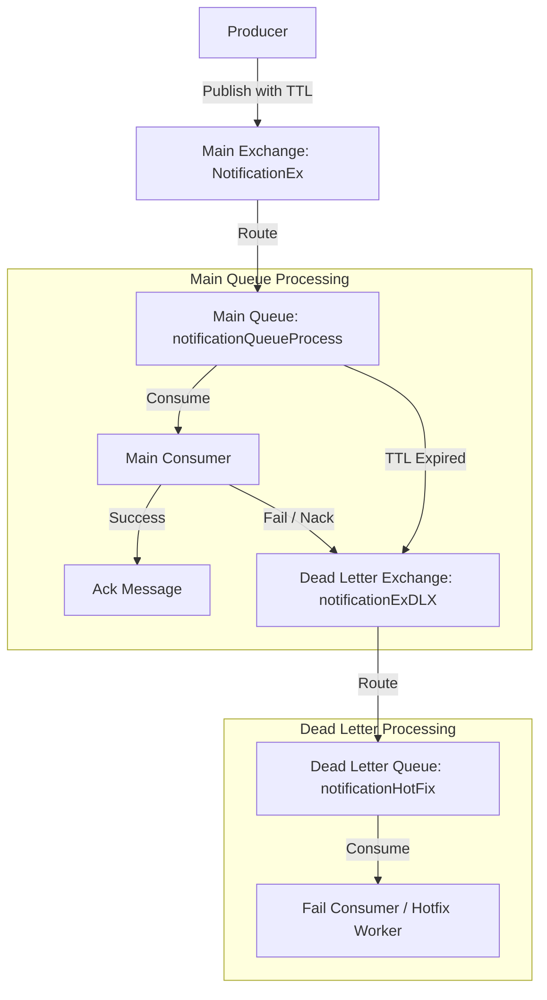

# Lesson 7 Exercise: Dead Letter Exchange (DLX) Pattern

In this exercise, you will implement a **Dead Letter Exchange (DLX)** pattern. This pattern is crucial in production environments for handling message processing failures, retries, and message expiration without losing data.

---

## The Architecture Flow



---

## Step-by-Step Tasks

### Task 1: Configure the Main Queue with DLX Settings
Open `practice/07.DLX/Producer.js` and `practice/07.DLX/Consumer.js`.
When asserting the main queue, you must configure it to forward dead-lettered messages to the Dead Letter Exchange.
*   **Goal**: Add `deadLetterExchange` and `deadLetterRoutingKey` to the options object when calling `channel.assertQueue()`.
*   **Goal**: In `Producer.js`, publish the message with a TTL (expiration) of 3 seconds (`3000` ms) to test the TTL expiration dead-lettering.

### Task 2: Implement Negative Acknowledgments (Nack)
Open `practice/07.DLX/Consumer.js`.
*   **Goal**: Consume messages from the main queue.
*   **Goal**: Simulate a processing failure (e.g., throw an error randomly or for specific messages).
*   **Goal**: In the `catch` block, reject the message using `channel.nack(msg, allUpTo, requeue)` where:
    - `allUpTo` is `false` (only reject the current message).
    - `requeue` is `false` (do NOT put it back in the main queue; this triggers the DLX routing).

### Task 3: Implement the Dead Letter Queue Consumer (Hotfix Worker)
Open `practice/07.DLX/ConsumerFail.js`.
*   **Goal**: Assert the Dead Letter Exchange and the Dead Letter Queue.
*   **Goal**: Bind the Dead Letter Queue to the Dead Letter Exchange using the dead-letter routing key.
*   **Goal**: Consume messages from the Dead Letter Queue and log them as failed messages requiring hotfix/manual intervention.

---

## How to Run and Test

1.  **Start RabbitMQ**:
    ```bash
    docker compose up -d
    ```

2.  **Start the Dead Letter Consumer (Hotfix Worker)**:
    ```bash
    node ConsumerFail.js
    ```

3.  **Start the Main Consumer**:
    ```bash
    node Consumer.js
    ```

4.  **Run the Producer**:
    ```bash
    node Producer.js
    ```

5.  **Observe the Behavior**:
    - Some messages will be processed successfully by `Consumer.js`.
    - Some messages will fail in `Consumer.js` and immediately appear in `ConsumerFail.js`.
    - If you run `Producer.js` while `Consumer.js` is **stopped**, wait 3 seconds. The message TTL will expire, and the message will automatically route to `ConsumerFail.js`.
