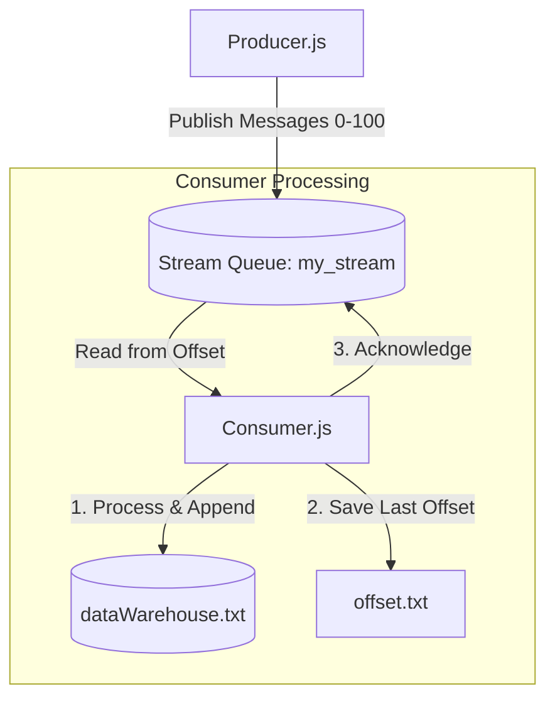

# Lesson 10 Exercise: RabbitMQ Stream Queue & Offset Management

In this exercise, you will work with **RabbitMQ Streams**. Unlike traditional queues where messages are deleted after consumption, a Stream is an append-only log that stores messages persistently. This allows consumers to read messages from any specific position (offset) and replay them as needed.

---

## The Architecture Flow



---

## Step-by-Step Tasks

### Task 1: Understand the Current Bug
Open `practice/10.STREAM/Consumer.js`. 
*   **Observation**: The consumer currently reads the last saved offset from `offset.txt` and logs it: `Starting from offset: X`.
*   **The Bug**: However, it does not actually instruct RabbitMQ to start consuming from that offset! It just consumes from the default position (which is usually the next new message or the beginning depending on the client).

### Task 2: Fix the Offset Consumption
Modify `Consumer.js` to consume messages starting from the offset read from `offset.txt`.
*   **Goal**: In RabbitMQ Streams, you must specify the starting offset when subscribing.
*   **Implementation**: In `channel.consume()`, pass the `arguments` option containing the starting offset.
    *   *Hint*: For `amqplib`, when consuming from a stream, you can specify the offset in the options object:
        ```javascript
        channel.consume(
          queueName,
          async (msg) => { ... },
          {
            noAck: false,
            arguments: {
              'x-stream-offset': offset // Can be an integer offset, 'first', 'last', or 'next'
            }
          }
        );
        ```
*   **Goal**: Ensure that if `offset.txt` does not exist or is empty, it defaults to `'first'` (to read from the beginning of the stream) or `0`.

### Task 3: Test the Replay and Resume Behavior
1.  Run the Producer to populate the stream with 101 messages:
    ```bash
    node Producer.js
    ```
2.  Run the Consumer to process some messages, then stop it (Ctrl+C) midway.
3.  Check `offset.txt` to see the last processed offset.
4.  Start the Consumer again. It should resume **exactly** from the next message after the saved offset, without reprocessing the older messages.
5.  Delete `offset.txt` and restart the Consumer. It should replay all 101 messages from the very beginning (`'first'`).

---

## How to Run and Test

1.  **Start RabbitMQ** (make sure the Stream plugin is enabled or use a RabbitMQ image that supports streams):
    ```bash
    docker compose up -d
    ```

2.  **Produce Messages**:
    ```bash
    node Producer.js
    ```

3.  **Consume and Track Offsets**:
    ```bash
    node Consumer.js
    ```

4.  **Verify Outputs**:
    - Check `dataWarehouse.txt` to see the processed messages.
    - Check `offset.txt` to see the tracked delivery tags.
